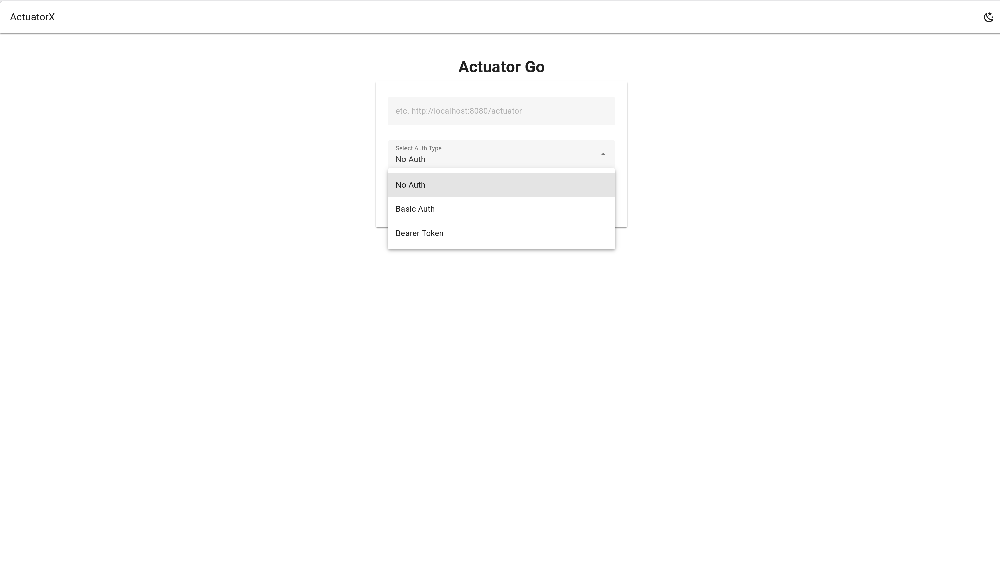
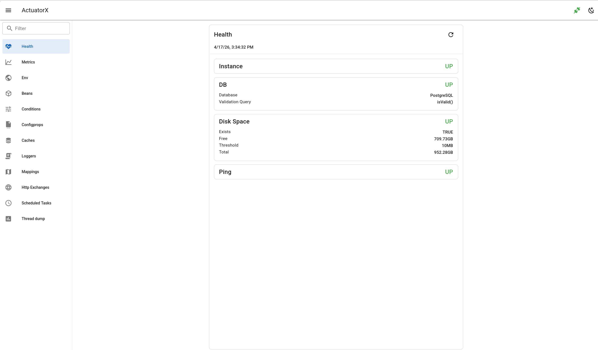
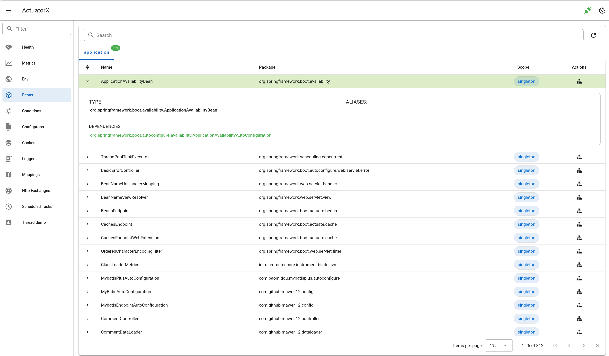
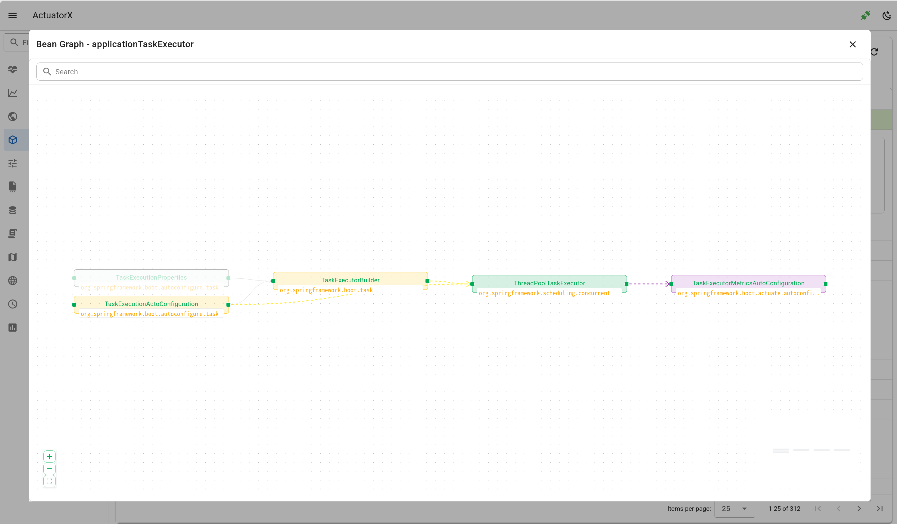

# actuatorx

A Spring Boot Actuator dashboard built with `golang` and `vue`.

Inspired by [ostara](https://github.com/krud-dev/ostara) and [pgweb](https://github.com/sosedoff/pgweb).

It currently provides the core functionality of Spring Boot Actuator and will support more features in the future.

## Endpoint Documentation

- [Design](doc/design.md)
- [Health](doc/health.md)
- [Metrics](doc/metrics.md)
- [Environment](doc/env.md)
- [Beans](doc/beans.md)
- [Conditions](doc/conditions.md)
- [Configprops](doc/configprops.md)
- [Caches](doc/caches.md)
- [Loggers](doc/loggers.md)
- [Mappings](doc/mappings.md)
- [Http Exchanges](doc/http_exchanges.md)
- [Scheduled Tasks](doc/scheduled_tasks.md)
- [Thread Dump](doc/thread_dump.md)

## Feature Examples

**Login**



**Health**



**Beans**





## Usage

**1. Start actuatorx on the default port (4000)**

```bash
./actuatorx
```

Or start it on a custom port:

```bash
./actuatorx --port 9080
```

**2. Open the page in your browser**

```bash
http://localhost:4000
```

**3. Enter the Actuator URL and authentication information**

## Language and Core Framework Information

| `Tech` | `Version` |
| --- | --- |
| `Golang` | `1.25.7` |
| `Gin` | `1.12.0` |
| `Vue` | `7.3.1` |
| `vuetify` | `3.11.6` |  