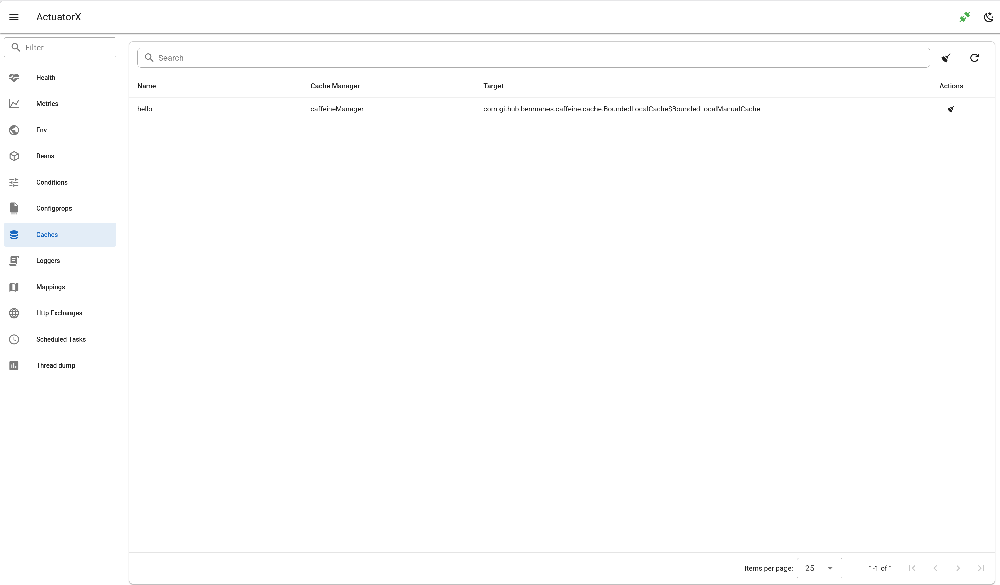

# Caches

- show caches as table
- search by cache name and manager
- evict cache and all caches

## Frontend page

`CachesPage.vue`

## Frontend api

- `getCaches.js`
- `evictAllCache.js`
- `evictCache.js`

## Backend api

- `api.go#GetCaches`
- `api.go#EvictAllCaches`
- `api.go#EvictCache`

## Backend client

- `client.go#Caches`
- `client.go#EvictAllCaches`
- `client.go#EvictCache`

## Spring Boot Endpoint 

- `/actutor/caches`
- `/actutor/caches/{cache}`

## Spring Boot doc 

https://docs.spring.io/spring-boot/api/rest/actuator/caches.html

