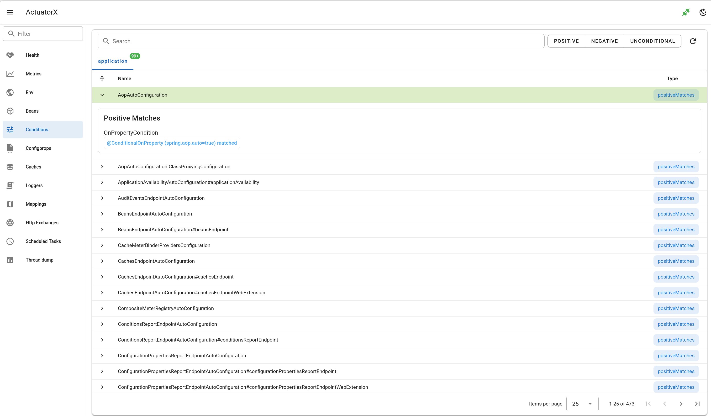

# Conditions

- Show data as table group by application context
- Support search by name
- Support condition detail

## Spring Boot doc

https://docs.spring.io/spring-boot/api/rest/actuator/conditions.html

## Spring Boot Endpoint 

`/actutor/conditions`

## Backend client

`client.go#Conditions`

## Backend api

`api.go#GetConditions`

## Frontend api

`getConditions.js`

## Frontend page

`ConditionsPage.vue`

