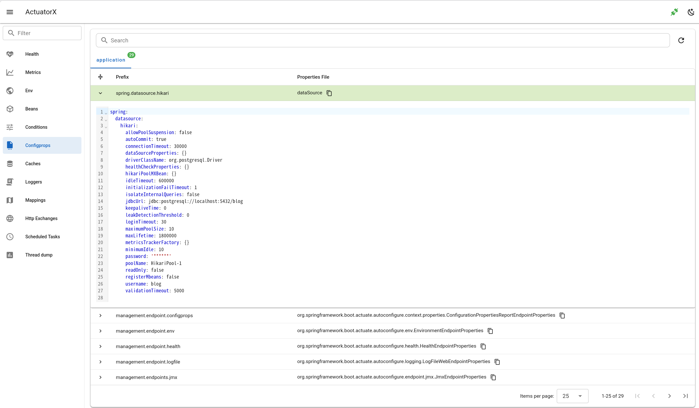

# Configprops

- Show configprops as table group by application context
- Support search by property prefix and name
- Support property detail

## Spring Boot doc 

https://docs.spring.io/spring-boot/api/rest/actuator/configprops.html

## Spring Boot Endpoint 

- `/actutor/configprops`
- `/actutor/configprops/{prefix}`

## Backend client

- `client.go#Configprops`

## Backend api

`api.go#GetConfigprops`

## Frontend api

`getConfigprops.js`

## Frontend page

`ConfigpropsPage.vue`

