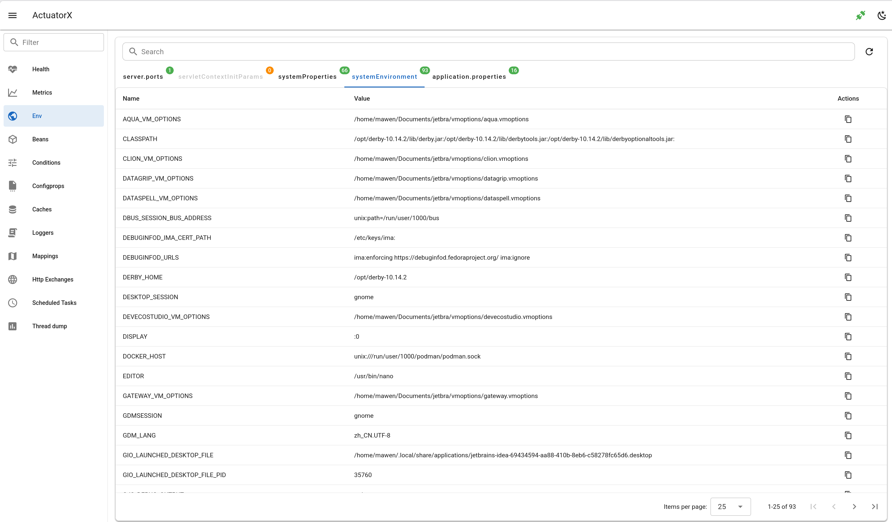

# Env

- Show environment properties in a table grouped by property source.
- Search by property name.
- Copy property names and values.

## Frontend page

- `EnvPage.vue`

## Frontend API

- `getEnv.js`

## Backend API

- `api.go#GetEnv`

## Backend client

- `client.go#Env`

## Spring Boot Endpoint 

- `/actuator/env`
- `/actuator/env/{toMatch}`

## Spring Boot docs 

https://docs.spring.io/spring-boot/api/rest/actuator/env.html

