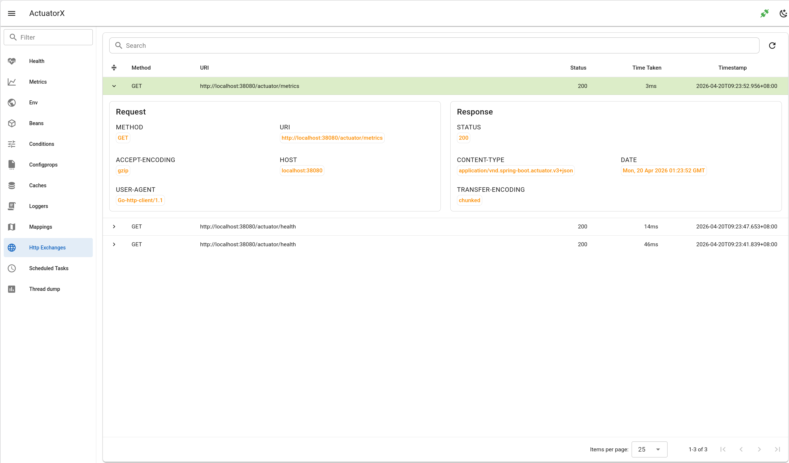

# Http Exchanges

- show http exchanges as table
- search by url and handler
- http exchange detail

## Frontend page

`HttpExchangesPage.vue`

## Frontend api

- `getHttpExchanges.js`

## Backend api

- `api.go#GetHttpExchanges`

## Backend client

- `client.go#HttpExchanges`

## Spring Boot Endpoint 

- `/actutor/httpexchanges`

## Spring Boot doc 

https://docs.spring.io/spring-boot/api/rest/actuator/httpexchanges.html

