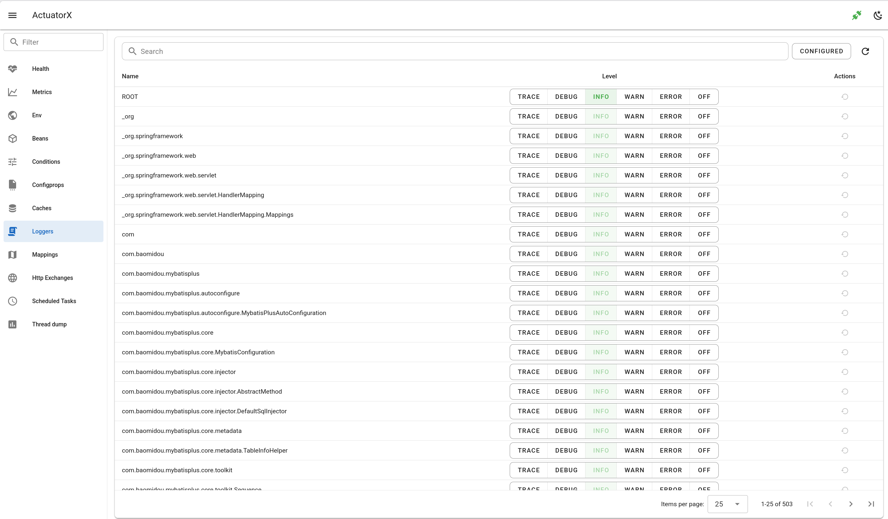

# Loggers

- show loggers as table
- search by logger name
- set and reset the logger level

## Frontend page

`LoggersPage.vue`

## Frontend api

- `getLoggers.js`
- `setLoggerLevel.js`

## Backend api

- `api.go#GetLoggers`
- `api.go#SetLoggerLevel`

## Backend client

- `client.go#GetLoggers`
- `client.go#SetLoggerLevel`

## Spring Boot Endpoint 

- `/actutor/loggers`
- `/actutor/loggers/{name}`

## Spring Boot doc 

https://docs.spring.io/spring-boot/api/rest/actuator/loggers.html

