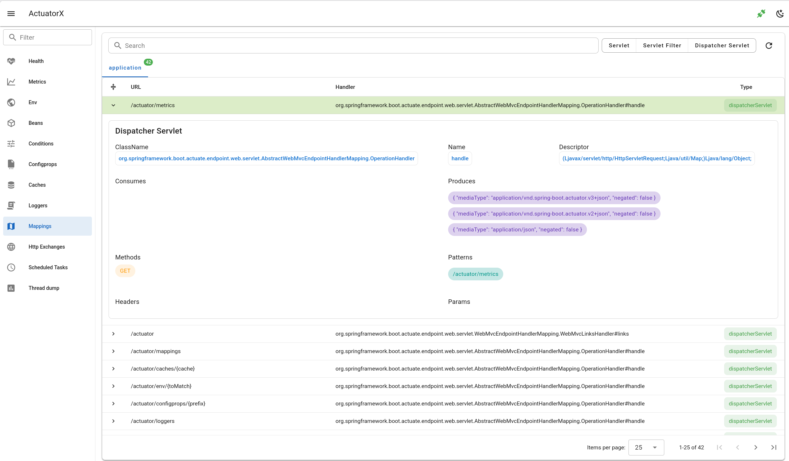

# Mappings

- show mappings as table
- search by url and handler
- mapping detail

## Frontend page

`MappingsPage.vue`

## Frontend api

- `getMappings.js`

## Backend api

- `api.go#GetMappings`

## Backend client

- `client.go#Mappings`

## Spring Boot Endpoint 

- `/actutor/mappings`

## Spring Boot doc 

https://docs.spring.io/spring-boot/api/rest/actuator/mappings.html

