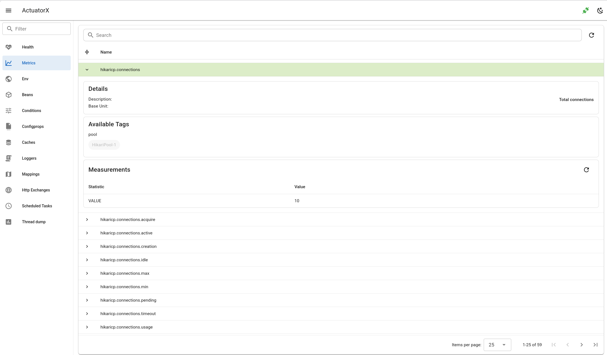

# Metrics

- Show data as table
- Support search by metric name
- Support metric detail(details, tags, measurements)
- Support filter by metric tag

## Spring Boot doc

https://docs.spring.io/spring-boot/api/rest/actuator/metrics.html

## Spring Boot Endpoint 

- `/actutor/metrics`
- `/actutor/metrics/{requiredMetricName}`

## Backend client

- `client.go#Metrics`
- `client.go#Metric`

## Backend api

- `api.go#GetMetrics`
- `api.go#GetMetric`

## Frontend api

- `getMetrics.js`
- `getMetricDetails.js`
- `getLatestMetric.js`

## Frontend page

`Metrics.vue`

