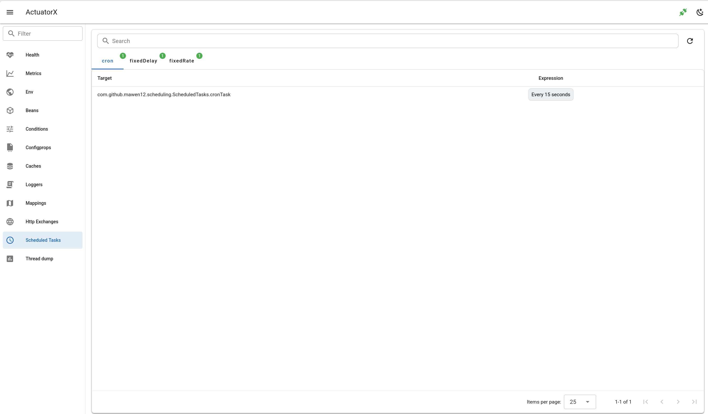

# Scheduled Tasks

- Show scheduled tasks, including cron, fixed-delay, and fixed-rate tasks, in a table.
- Search by target.

## Frontend page

- `ScheduledTasksPage.vue`

## Frontend API

- `getScheduledTasks.js`

## Backend API

- `api.go#GetScheduledTasks`

## Backend client

- `client.go#ScheduledTasks`

## Spring Boot Endpoint 

- `/actuator/scheduledtasks`

## Spring Boot docs 

https://docs.spring.io/spring-boot/api/rest/actuator/scheduledtasks.html

