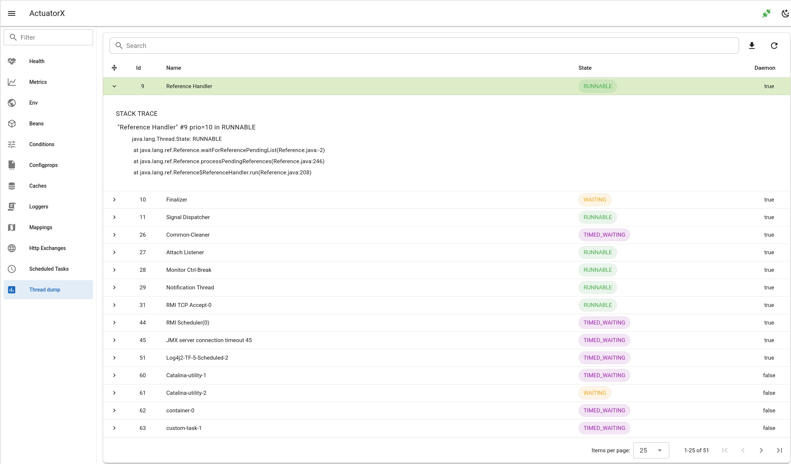

# Thread Dump

- Show threads in a table.
- Search by thread ID, thread name, or thread state.
- Download the thread dump.

## Frontend page

- `ThreadDumpPage.vue`

## Frontend API

- `getThreaddump.js`

## Backend API

- `api.go#GetThreadDump`
- `api.go#DownloadThreadDump`

## Backend client

- `client.go#ThreadDump`
- `client.go#DownloadThreadDump`

## Spring Boot Endpoint 

- `/actuator/threaddump`

## Spring Boot docs 

https://docs.spring.io/spring-boot/api/rest/actuator/threaddump.html

